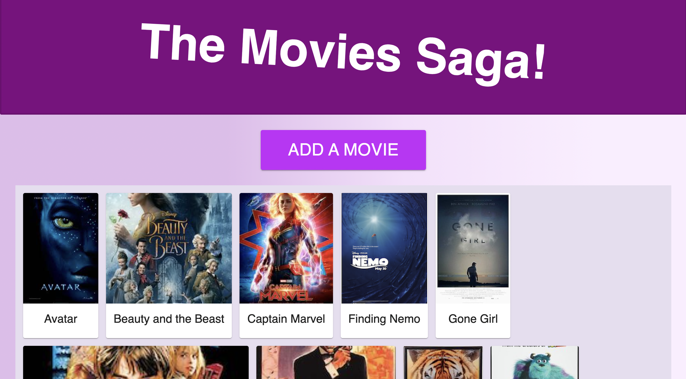

# PROJECT NAME

## Description

_Duration: Weekend Sprint_

This site is a movie gallery page that shows you details about the movies inside of it. Different movies from a database are stored on the site, you can also add your own movies, and find out more details about existing ones.

## Screen Shot

---

### Prerequisites

- [Node.js](https://nodejs.org/en/)
- Something to create a database

## Installation

1. Create a database named `saga_movies_weekend`,
2. The queries in the `database.sql` file are set up to create all the necessary tables and populate the needed data to allow the application to run correctly. The project is built on [Postgres](https://www.postgresql.org/download/), so you will need to make sure to have that installed. We recommend using Postico to run those queries as that was used to create the queries, 
3. Open up your editor of choice and run an `npm install`
4. Run `npm run server` in your terminal
5. Run `npm run client` in your terminal
6. The `npm run client` command will open up a new browser tab for you!

## Usage

1. On the landing page you can see the full list of movies, click the 'add new movie' button to add a movie.
2. Next add a title, image url, description, and genre to the form. Click the save button to submit the form.
3. You can click on any movie to inspect it, doing so will bring you to the details view, which displays the movie image, title, and genre. 

## Built With

- Node.js
- Postico
- React
- Material UI 

## Acknowledgement
Thanks to [Prime Digital Academy](www.primeacademy.io) who equipped and helped me to make this application a reality, and my instructor Matt who taught us the content.

## Support
If you have suggestions or issues, please email me at [smrdelb@gmail.com](smrdelb@gmail.com)